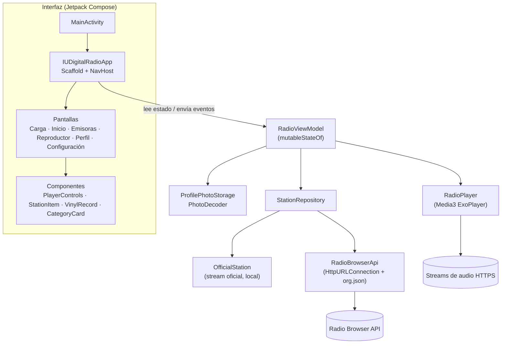
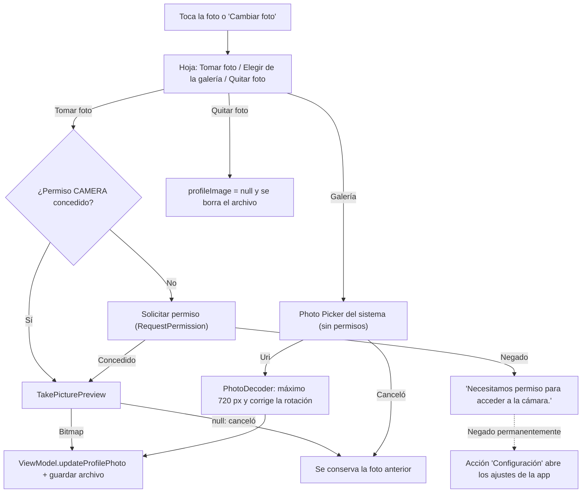
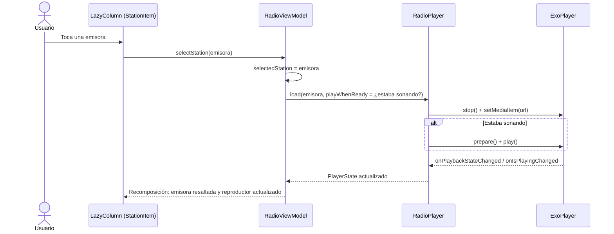
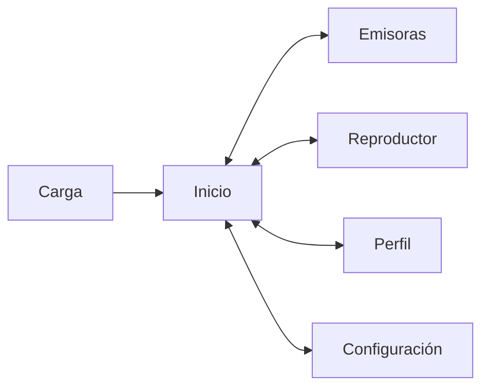

# Manual técnico — IU Digital Radio

| | |
|---|---|
| **Institución** | Institución Universitaria Digital de Antioquia (IU Digital) |
| **Actividad** | Evidencia de aprendizaje 3 – Taller práctico: Aplicación Móvil Android "IU Digital Radio" |
| **Asignatura** | _[Completar]_ |
| **Docente** | _[Completar]_ |
| **Integrantes** | Ver [Equipo y roles](#21-equipo-y-roles) (6 integrantes) |
| **Versión de la app** | 1.0.0 (versionCode 1) |
| **Paquete** | `com.iudigital.iudigitalradio` |
| **Repositorio** | <https://github.com/JDProgramer802/IUDigitalRadio> |
| **Video de demostración** | _[Pegar enlace del video (2 a 4 minutos)]_ |
| **Fecha** | _[Completar]_ |

> Las secciones marcadas con _[Completar]_ o _Pendiente_ las llena el equipo con los datos reales
> (nombres, enlaces, capturas y resultados de las pruebas en el celular).

## Contenido

1. [Descripción general](#1-descripción-general)
2. [Requisitos cubiertos](#2-requisitos-cubiertos)
3. [Tecnologías y versiones](#3-tecnologías-y-versiones)
4. [Arquitectura](#4-arquitectura)
5. [Estructura del proyecto](#5-estructura-del-proyecto)
6. [Manejo de estado (RF-04)](#6-manejo-de-estado-rf-04)
7. [Reproducción de audio (RF-07)](#7-reproducción-de-audio-rf-07)
8. [Emisora oficial y origen del stream](#8-emisora-oficial-y-origen-del-stream)
9. [Emisoras externas: Radio Browser](#9-emisoras-externas-radio-browser)
10. [Cámara, galería y foto de perfil (RF-02)](#10-cámara-galería-y-foto-de-perfil-rf-02)
11. [Permisos (RF-03)](#11-permisos-rf-03)
12. [Vibración (RF-05)](#12-vibración-rf-05)
13. [Lista dinámica y cambio de emisora (RF-06)](#13-lista-dinámica-y-cambio-de-emisora-rf-06)
14. [Interfaz y navegación (RF-01)](#14-interfaz-y-navegación-rf-01)
15. [Manejo de errores](#15-manejo-de-errores)
16. [Privacidad y seguridad](#16-privacidad-y-seguridad)
17. [Pruebas](#17-pruebas)
18. [Compilación y generación del APK](#18-compilación-y-generación-del-apk)
19. [Instalación en el celular](#19-instalación-en-el-celular)
20. [Guía para el video de demostración](#20-guía-para-el-video-de-demostración)
21. [Equipo y roles](#21-equipo-y-roles)
22. [Evidencias](#22-evidencias)
23. [Limitaciones conocidas y trabajo futuro](#23-limitaciones-conocidas-y-trabajo-futuro)
24. [Referencias](#24-referencias)

---

## 1. Descripción general

IU Digital Radio es una aplicación Android nativa, escrita en Kotlin con Jetpack Compose, para
escuchar la emisora oficial de la IU Digital. Permite:

- Reproducir en vivo **IU Digital Radio** (stream oficial publicado en la página de la institución).
- Pausar, reanudar y silenciar el audio, con **vibración** al usar Play, Pause y Mute.
- Explorar **otras emisoras** reales obtenidas de la API gratuita Radio Browser, organizadas por tipo
  de radio (Colombia, Populares, Rock, Pop, Salsa, Jazz, Clásica), cada tipo con su propia portada.
- Cambiar la emisora activa desde una **lista dinámica (LazyColumn)**.
- Tomar la foto de perfil con la **cámara** (o elegirla de la galería) y verla en el perfil.
- Conservar el estado ante rotaciones y cambios de configuración.

Las emisoras externas se identifican siempre como "Otras emisoras" y nunca como emisoras de la IU Digital.

## 2. Requisitos cubiertos

| RF | Requisito de la guía | Implementación | Archivos principales |
|---|---|---|---|
| RF-01 | Interfaz declarativa con Jetpack Compose | Todas las pantallas son composables (`Scaffold`, `TopAppBar`, `Card`, `LazyColumn`, `Row`, `Column`, `Button`, `IconButton`, `Image`, `Text`). No hay layouts XML. | `ui/` |
| RF-02 | Cámara nativa | `ActivityResultContracts.TakePicturePreview` entrega un `Bitmap` que se muestra en el perfil. Adicional: galería con `PickVisualMedia`. | `camera/CameraLauncher.kt`, `camera/GalleryLauncher.kt` |
| RF-03 | Permisos de cámara y vibración | `CAMERA`, `VIBRATE` e `INTERNET` en el manifiesto; `CAMERA` se solicita en tiempo de ejecución antes de abrir la cámara. | `AndroidManifest.xml`, `permissions/PermissionHandler.kt` |
| RF-04 | Estado con `mutableStateOf` y `rememberSaveable` | `isPlaying`, `isMuted`, `selectedStation`, `profileImage` y demás estados en `mutableStateOf`; datos simples de UI en `rememberSaveable`. | `ui/RadioViewModel.kt`, `audio/RadioPlayer.kt`, `ui/IUDigitalRadioApp.kt` |
| RF-05 | Vibración en Play, Pause y Mute | `performHapticFeedback()` con `VibratorManager` (Android 12+) o `Vibrator`. | `utils/HapticFeedback.kt`, `ui/components/PlayerControls.kt` |
| RF-06 | Lista dinámica y cambio de emisora | Catálogo en `LazyColumn`; al tocar una emisora `selectedStation` cambia y el reproductor se actualiza. | `ui/screens/HomeScreen.kt`, `ui/screens/StationsScreen.kt`, `ui/components/StationItem.kt` |
| RF-07 | Streaming con Media3 ExoPlayer | `RadioPlayer` envuelve ExoPlayer, separado de la UI. | `audio/RadioPlayer.kt`, `audio/PlayerState.kt` |

## 3. Tecnologías y versiones

| Componente | Versión | Uso |
|---|---|---|
| Kotlin | 2.2.10 | Lenguaje |
| Android Gradle Plugin | 9.3.3 | Compilación (Kotlin integrado en AGP 9) |
| Gradle | 9.5.0 (wrapper) | Sistema de construcción |
| JDK para Gradle | 25 (JBR incluido en Android Studio) | Exigido por `gradle/gradle-daemon-jvm.properties` |
| compileSdk / targetSdk | 37 | |
| minSdk | 24 (Android 7.0) | |
| Compose BOM | 2026.02.01 | Jetpack Compose + Material 3 |
| Material Icons Extended | 1.7.8 | Íconos Material |
| Navigation Compose | 2.9.8 | Navegación entre pantallas |
| Lifecycle (ViewModel, runtime-compose) | 2.10.0 | ViewModel y ciclo de vida |
| Activity Compose | 1.13.0 | `setContent`, Activity Result APIs |
| Core KTX | 1.17.0 | Utilidades de AndroidX |
| Media3 ExoPlayer | 1.10.1 | Reproducción de streaming |
| Coil (compose + network-okhttp) | 3.3.0 | Logos de las emisoras externas |
| JUnit | 4.13.2 | Pruebas unitarias |
| Compose UI Test | según BOM | Pruebas instrumentadas de interfaz |

Para consultar Radio Browser se usan `HttpURLConnection` y `org.json`, que vienen con Android, para no
agregar librerías de red adicionales.

## 4. Arquitectura

Se usa una arquitectura sencilla por capas con **flujo de datos unidireccional**: el estado baja del
ViewModel a las pantallas y los eventos (toques) suben como llamadas a funciones.



Decisiones principales:

- **Un solo `RadioViewModel`**, ligado a `MainActivity`. Sobrevive a las rotaciones, así que la
  instancia de ExoPlayer no se recrea y el audio no se corta al girar el celular.
- **El reproductor está separado de la UI** (`RadioPlayer`). Las pantallas no tocan ExoPlayer: solo leen
  `PlayerState` y llaman `play()`, `pause()` o `toggleMute()`.
- **La emisora oficial es local.** Aunque Radio Browser falle, IU Digital Radio siempre está disponible.
- **Recursos liberados:** `RadioViewModel.onCleared()` llama `RadioPlayer.release()`.

## 5. Estructura del proyecto

```
app/src/main/
├── AndroidManifest.xml
├── java/com/iudigital/iudigitalradio/
│   ├── MainActivity.kt                  Actividad única; aplica el tema y crea el ViewModel
│   ├── audio/
│   │   ├── PlayerState.kt               Estado observable del reproductor
│   │   └── RadioPlayer.kt               Envoltorio de Media3 ExoPlayer
│   ├── camera/
│   │   ├── CameraLauncher.kt            Permiso CAMERA + TakePicturePreview
│   │   ├── GalleryLauncher.kt           Selector de fotos del sistema (PickVisualMedia)
│   │   ├── PhotoDecoder.kt              Reduce y endereza imágenes de la galería
│   │   └── ProfilePhotoStorage.kt       Guarda/borra la foto en almacenamiento privado
│   ├── data/
│   │   ├── OfficialRadio.kt             URL del stream oficial y emisora oficial
│   │   ├── model/
│   │   │   ├── RadioStation.kt          Modelo de emisora
│   │   │   └── StationCategory.kt       Tipos de radio (Colombia, Rock, Jazz…)
│   │   ├── remote/
│   │   │   ├── RadioBrowserApi.kt       Cliente HTTP de Radio Browser
│   │   │   └── RadioBrowserStationDto.kt Modelo de la respuesta JSON
│   │   └── repository/
│   │       ├── StationRepository.kt     Filtra y convierte emisoras externas
│   │       └── StationsUiState.kt       Cargando / Vacío / Éxito / Error
│   ├── permissions/
│   │   └── PermissionHandler.kt         Consulta de permisos y acceso a Configuración
│   ├── ui/
│   │   ├── IUDigitalRadioApp.kt         Scaffold, navegación, mensajes y ciclo de vida
│   │   ├── RadioViewModel.kt            Estado global de la app
│   │   ├── components/                  Componentes reutilizables
│   │   ├── navigation/                  Destinos y barra de navegación flotante
│   │   ├── screens/                     Carga, Inicio, Emisoras, Reproductor, Perfil, Configuración
│   │   └── theme/                       Colores, tipografía y tema claro/oscuro
│   └── utils/
│       ├── HapticFeedback.kt            performHapticFeedback()
│       └── UserMessages.kt              Mensajes al usuario y clasificación de errores de red
└── res/
    ├── drawable-nodpi/logo_iudigital_radio.png   Logo completo del proyecto
    ├── drawable-nodpi/logo_mark.png              Marca (audífonos + ecualizador), derivada del logo
    ├── mipmap-*/ic_launcher*.png                 Íconos de la app generados desde el logo
    └── xml/backup_rules.xml, data_extraction_rules.xml
app/src/test/          Pruebas unitarias (JVM)
app/src/androidTest/   Pruebas instrumentadas de interfaz (Compose)
docs/                  Documentación (este manual)
```

## 6. Manejo de estado (RF-04)

| Estado | Dónde vive | Mecanismo | ¿Sobrevive a una rotación? | ¿Sobrevive si Android recrea el proceso? |
|---|---|---|---|---|
| `selectedStation` | `RadioViewModel` | `mutableStateOf` | Sí | No (vuelve a la emisora oficial) |
| `isPlaying`, `isLoading`, `playerError`, `nowPlaying` | `RadioPlayer.state` (`PlayerState`) | `mutableStateOf` | Sí | No |
| `isMuted` | `RadioPlayer.state` (`PlayerState`) | `mutableStateOf` | Sí | No |
| `profileImage` (`Bitmap`) | `RadioViewModel` + archivo privado | `mutableStateOf` + `ProfilePhotoStorage` | Sí | Sí, y también al cerrar la app (se relee del archivo) |
| `stationCategory` | `RadioViewModel` | `mutableStateOf` | Sí | No |
| `externalStations` (`StationsUiState`) | `RadioViewModel` | `mutableStateOf` | Sí | No (se vuelve a consultar) |
| `recentStations` (historial) | `RadioViewModel` | `mutableStateListOf` | Sí | No |
| `userName` (nombre del perfil) | `IUDigitalRadioApp` | `rememberSaveable` | Sí | Sí |
| `themeMode` (tema) | `MainActivity` | `rememberSaveable` | Sí | Sí |
| Texto de búsqueda | `StationsScreen` | `rememberSaveable` | Sí | Sí |
| Diálogos abiertos (`showPhotoOptions`, `showNameDialog`) | UI | `rememberSaveable` | Sí | Sí |

Por qué se reparten así:

- **`rememberSaveable`** guarda valores en el `Bundle` de la actividad, así que solo se usa para datos
  simples (textos, booleanos, enums).
- **El `Bitmap` de la cámara y ExoPlayer no se guardan en `rememberSaveable`.** El `Bitmap` puede
  superar el tamaño permitido del `Bundle` y ExoPlayer no es serializable. Viven en el `ViewModel`,
  que sobrevive a los cambios de configuración. La foto además se guarda en un archivo privado.
- Todos los estados que lee la UI son `mutableStateOf`, así que Compose recompone automáticamente.

## 7. Reproducción de audio (RF-07)

`RadioPlayer` (`audio/RadioPlayer.kt`) crea **una sola** instancia de ExoPlayer con:

- `AudioAttributes` de música (`USAGE_MEDIA`, `AUDIO_CONTENT_TYPE_MUSIC`) y manejo del foco de audio
  (se pausa si otra app toma el audio).
- `setHandleAudioBecomingNoisy(true)`: pausa si se desconectan los audífonos.

| Operación | Qué hace |
|---|---|
| `load(station, playWhenReady)` | `stop()` del stream anterior, `setMediaItem()` con la URL de la nueva emisora y, si corresponde, reproduce. |
| `play()` | Si el reproductor está en reposo (primera vez o tras un error) llama `prepare()`, y luego `play()`. Sirve también para reintentar. |
| `pause()` | Pausa la reproducción. |
| `setMuted(muted)` | Volumen 0 o 1 y actualiza `isMuted`. |
| `release()` | Quita el listener y libera ExoPlayer. |

Eventos de ExoPlayer que se atienden:

| Callback | Efecto en el estado |
|---|---|
| `onPlaybackStateChanged` | `STATE_READY` (onReady) limpia el error; `STATE_BUFFERING` marca `isLoading`. |
| `onIsPlayingChanged` | Actualiza `isPlaying` (muestra "EN VIVO" y anima el vinilo). |
| `onPlayerError` | `isPlaying = false` y `playerError` con un mensaje para el usuario. |
| `onMediaMetadataChanged` | `nowPlaying` con el título que envía la emisora (metadatos ICY), si lo envía. |

**Ciclo de vida:** la app no tiene servicio en segundo plano, porque exigiría permisos adicionales de
servicio en primer plano. Por eso `AppLifecycleEffect` (un `DisposableEffect` con
`LifecycleEventObserver`) pausa el audio cuando la app pasa a segundo plano y lo reanuda al volver.
Una rotación no cuenta como salir de la app (`isChangingConfigurations`).

## 8. Emisora oficial y origen del stream

La URL del stream se tomó de la página oficial de la emisora:

1. `https://www.iudigital.edu.co/index.php/radio` incrusta un reproductor titulado **"Radio IU Digital"**:
   `https://streamingcwsradio30.com/cp/widgets/player/single/?p=8316`
2. Ese reproductor carga el audio desde **`https://streamingcwsradio30.com:8316/stream`**.
3. Verificación hecha el 21/09/2026: el servidor respondió `HTTP 200` con las cabeceras
   `icy-name: IU Digital Radio`, `content-type: audio/aacp`, `icy-br: 128` e `icy-sr: 24000`, por HTTPS
   con certificado válido. El contenido recibido correspondía a tramas de audio AAC (ADTS).

La URL está en una sola constante:

```kotlin
// app/src/main/java/com/iudigital/iudigitalradio/data/OfficialRadio.kt
const val OFFICIAL_RADIO_STREAM = "https://streamingcwsradio30.com:8316/stream"
```

Si la institución cambia de proveedor de streaming, basta con actualizar esa constante.

## 9. Emisoras externas: Radio Browser

Radio Browser es un catálogo comunitario y gratuito de emisoras. **No requiere API key.** Sus emisoras
se muestran como "Otras emisoras" con la nota "No pertenecen a IU Digital".

**Petición:** `GET {servidor}/json/stations/search` con estos parámetros:

| Parámetro | Valor | Motivo |
|---|---|---|
| `hidebroken` | `true` | Solo emisoras que funcionaron en la última verificación de Radio Browser |
| `is_https` | `true` | Android bloquea el tráfico HTTP sin cifrar |
| `order` / `reverse` | `clickcount` / `true` | Las más escuchadas primero |
| `limit` | `60` | Tamaño de la lista |
| `countrycode` o `tag` | según el tipo de radio | Ver la tabla siguiente |

| Tipo de radio | Filtro | Colores de la portada | Ícono |
|---|---|---|---|
| Colombia | `countrycode=CO` | `#F4B400` → `#003893` → `#CE1126` (bandera) | Ubicación |
| Populares | sin filtro | `#FF8A00` → `#E52E71` | Tendencia |
| Rock | `tag=rock` | `#232526` → `#B31217` | Rayo |
| Pop | `tag=pop` | `#FC466B` → `#3F5EFB` | Micrófono |
| Salsa | `tag=salsa` | `#FF512F` → `#F09819` | Vida nocturna |
| Jazz | `tag=jazz` | `#2C1A4D` → `#8E54E9` | Piano |
| Clásica | `tag=classical` | `#134E5E` → `#3BB2B8` | Biblioteca musical |

**Robustez:**

- Servidores: `https://all.api.radio-browser.info` y, si falla, `https://de1.api.radio-browser.info`.
- Tiempos límite: conexión 8 s y lectura 10 s. La petición corre en `Dispatchers.IO` dentro de
  `viewModelScope`; al cambiar de tipo de radio se cancela la petición anterior.
- Encabezado `User-Agent: IUDigitalRadio/1.0.0`, como pide Radio Browser.
- Filtro en la app (`StationRepository.toPlayableStations`): stream HTTPS, sin HLS, códec MP3/AAC/AAC+,
  nombre no vacío y sin duplicados. **Se descarta cualquier entrada que se haga pasar por la emisora
  oficial** (nombre con "IU Digital" o misma URL del stream oficial).
- El tipo de radio de cada emisora se deduce de sus etiquetas (por ejemplo "smooth jazz" → Jazz). Si no
  coincide con ninguna, se usa el tipo consultado.
- **Logos:** se usa el campo `favicon`, siempre por HTTPS. Coil lo descarga a un máximo de 256 px. Si no
  existe, falla o mide menos de 96 px (se vería borroso), se muestra la portada del tipo de radio.

Verificación manual hecha el 21/09/2026 con `limit=40`: Colombia devolvió 40 emisoras (38 reproducibles
según los filtros), Rock 40 (35), Salsa 40 (37) y Jazz 40 (37). Los resultados cambian con el tiempo
porque dependen del catálogo comunitario.

## 10. Cámara, galería y foto de perfil (RF-02)

Al tocar la foto de perfil (en Inicio o Perfil) o el botón "Cambiar foto" se abre una hoja inferior con
tres opciones.



- **Cámara:** `CameraLauncher.kt` usa exactamente `ActivityResultContracts.TakePicturePreview`, que
  devuelve un `Bitmap` en miniatura. Si no hay app de cámara (`ActivityNotFoundException`) se informa
  al usuario.
- **Galería:** `GalleryLauncher.kt` usa `ActivityResultContracts.PickVisualMedia` (solo imágenes). No
  necesita permisos de almacenamiento.
- **Decodificación:** `PhotoDecoder.kt` reduce la imagen a 720 px como máximo. En Android 9+ usa
  `ImageDecoder`; en Android 7–8 usa `BitmapFactory` y corrige la rotación leyendo el EXIF.
- **Almacenamiento:** `ProfilePhotoStorage.kt` guarda la foto como `profile_photo.png` en el
  almacenamiento privado de la app (`filesDir`), fuera de las copias de seguridad.
- El manifiesto declara la cámara como opcional (`uses-feature ... required="false"`), así que la app se
  puede instalar en dispositivos sin cámara.

## 11. Permisos (RF-03)

```xml
<uses-permission android:name="android.permission.CAMERA" />
<uses-permission android:name="android.permission.VIBRATE" />
<uses-permission android:name="android.permission.INTERNET" />
```

| Permiso | Tipo | Cuándo se pide |
|---|---|---|
| `CAMERA` | Peligroso | En tiempo de ejecución, justo antes de abrir la cámara. Si se niega, la app sigue funcionando y muestra un mensaje. |
| `VIBRATE` | Normal | Se concede al instalar. |
| `INTERNET` | Normal | Se concede al instalar. |

- Media3 declara `ACCESS_NETWORK_STATE` y `WAKE_LOCK`. La app **no los usa** (no consulta el estado de
  la red ni activa `setWakeMode`), así que se eliminan del manifiesto final con `tools:node="remove"`.
- AndroidX Core agrega `com.iudigital.iudigitalradio.DYNAMIC_RECEIVER_NOT_EXPORTED_PERMISSION`. Es un
  permiso interno de nivel "firma" que la app define para sí misma. No se le muestra ni se le pide al
  usuario.
- La galería (Photo Picker) no requiere permisos de lectura de imágenes.
- Verificado con `aapt2 dump permissions` sobre el APK release: `CAMERA`, `VIBRATE`, `INTERNET` y el
  permiso interno anterior.

## 12. Vibración (RF-05)

```kotlin
// utils/HapticFeedback.kt
fun performHapticFeedback(context: Context, durationMs: Long = 45L)
```

- Android 12+ (API 31): `VibratorManager.defaultVibrator`. Versiones anteriores: `Vibrator` del sistema.
- Android 8+ (API 26): `VibrationEffect.createOneShot(...)`. Android 7: `vibrate(ms)`.
- Si el dispositivo no tiene vibrador (`hasVibrator() == false`) no hace nada.
- Se llama al presionar **Play, Pause y Mute**, tanto en los controles grandes como en el mini
  reproductor (`PlayerControls.kt`).
- Los emuladores no vibran físicamente: esta prueba debe hacerse en un celular real.

## 13. Lista dinámica y cambio de emisora (RF-06)

- **Inicio:** `LazyColumn` con perfil, reproductor, tipos de radio, emisora oficial y las 5 primeras
  emisoras externas.
- **Emisoras:** `LazyColumn` con la emisora oficial y el catálogo externo completo (con buscador y
  `LazyRow` de tipos de radio).
- **Perfil:** `LazyColumn` con el historial de la sesión.
- Cada fila (`StationItem`) usa como clave el identificador de la emisora y marca la semántica
  `selected` (accesibilidad y pruebas).



La emisora activa se resalta con borde de colores, fondo azul claro y un ecualizador con la etiqueta
"SONANDO" (o "ACTIVA" si está en pausa).

## 14. Interfaz y navegación (RF-01)

### Pantallas

| Pantalla | Contenido |
|---|---|
| **Carga** | Logo completo de IU Digital Radio sobre una tarjeta blanca con ondas de radio, "Tu música, tu momento", barra de progreso y estado real del arranque ("Cargando emisoras…", "¡Todo listo!" o el error de red). Dura como mínimo 1,8 s y como máximo 4 s, aunque la API externa no responda. |
| **Inicio** | Saludo según la hora con la foto de perfil (tocarla abre las opciones de foto) y acceso al perfil. Reproductor tipo "escenario": vinilo que gira mientras suena, ondas, etiqueta **EN VIVO**, visualizador y Play / Pause / Mute. Carrusel "Explora por tipo de radio", emisora oficial y otras emisoras con "Ver todas". |
| **Emisoras** | Buscador por nombre, país o género; carrusel de tipos de radio; emisora oficial destacada; lista externa con contador y estados de carga, vacío y error. |
| **Reproductor** | Escenario grande con el vinilo; el color de fondo cambia según el tipo de radio. Calidad de audio, estado, "Sonando ahora" (si la emisora envía el título), controles y "Cambiar de emisora". |
| **Perfil** | Banner con degradado, foto con anillo de colores, nombre editable, "Cuenta de demostración", estadísticas de la sesión, historial y nota de privacidad. |
| **Configuración** | Tema Sistema / Claro / Oscuro (**funcional**); calidad de audio (informativa); Ahorro de datos y Notificaciones deshabilitados con la nota "No disponible en esta versión"; Acerca de (versión y enlaces). |

Elementos comunes: `TopAppBar` con título y subtítulo, barra de navegación flotante de 5 pestañas, mini
reproductor flotante (en Emisoras, Perfil y Configuración) y mensajes tipo `Snackbar`.

### Navegación (Navigation Compose)



Rutas: `loading`, `home`, `stations`, `player`, `profile`, `settings`. La pantalla de carga se elimina
de la pila (`popUpTo(inclusive = true)`), así que "Atrás" no vuelve a ella. Las pestañas usan
`launchSingleTop`, `saveState` y `restoreState`.

### Sistema de diseño

| Elemento | Valor |
|---|---|
| Navy (fondos de escenario, textos) | `#060F26`, `#0B1B3F`, `#12306B` |
| Azul de marca (acento) | `#1A73FF` |
| Acentos de degradado | Cian `#22D3EE`, violeta `#8B5CF6` |
| Fondo claro / tarjetas | `#F4F7FC` / blanco |
| Rojo "EN VIVO" | `#E5383B` |
| Tipografía | Fuente del sistema; títulos en ExtraBold con interletrado compacto |
| Formas | Esquinas redondeadas de 12 a 32 dp; tarjetas con sombra suave |
| Tema oscuro | Paleta propia (`DarkBackground #070F22`, `DarkSurface #0F1A33`) |

**Recursos gráficos:** `logo_iudigital_radio.png` es el logo entregado por el equipo.
`logo_mark.png` (audífonos + ecualizador) y los íconos del launcher (adaptativo, redondo y
monocromático) se generaron a partir de ese logo.

## 15. Manejo de errores

| Situación | Mensaje | Dónde aparece |
|---|---|---|
| Sin Internet (API o stream) | "No hay conexión a Internet." | Pantalla de carga, catálogo (con "Reintentar") y reproductor |
| El stream no se puede reproducir | "No fue posible reproducir esta emisora." | Reproductor (Play vuelve a intentar) |
| Falla de Radio Browser | "No fue posible cargar las emisoras externas." | Catálogo (con "Reintentar") |
| Radio Browser no responde a tiempo | "Radio Browser tardó demasiado en responder. Intenta de nuevo." | Catálogo |
| Permiso de cámara negado | "Necesitamos permiso para acceder a la cámara." | Mensaje (con acción "Configuración" si se negó permanentemente) |
| Cámara cancelada | "No se tomó ninguna foto. Se conserva la foto anterior." | Mensaje informativo |
| Galería cancelada | "No se seleccionó ninguna imagen. Se conserva la foto anterior." | Mensaje informativo |
| Imagen no válida | "No fue posible cargar la imagen seleccionada." | Mensaje |
| Sin app de cámara | "No fue posible abrir la cámara en este dispositivo." | Mensaje |
| Catálogo vacío | "No se encontraron emisoras externas para este tipo de radio." | Catálogo |
| Búsqueda sin resultados | "Ninguna emisora coincide con "…"." | Emisoras |

La clasificación de errores de red está en `utils/UserMessages.kt`. `UnknownHostException` o una red
inalcanzable cuentan como "sin Internet"; `SocketTimeoutException` como tiempo agotado. La app no usa
`ACCESS_NETWORK_STATE`: detecta la falta de red por el error de conexión.

## 16. Privacidad y seguridad

- No hay cuentas, contraseñas ni datos personales reales. El perfil de demostración usa
  "Usuario de prueba" y el nombre solo existe en la sesión.
- La foto de perfil se guarda **solo en el dispositivo**, en el almacenamiento privado de la app, y está
  excluida de las copias de seguridad en la nube y de la transferencia entre dispositivos
  (`backup_rules.xml`, `data_extraction_rules.xml`).
- No hay claves de API ni secretos en el código (Radio Browser no las requiere).
- Todo el tráfico es HTTPS. Android bloquea el HTTP sin cifrar y la app no lo habilita.
- Los logos y streams de emisoras externas se descargan de los servidores de cada emisora, como en
  cualquier reproductor de radio en línea.

## 17. Pruebas

### 17.1 Pruebas automatizadas

**Pruebas unitarias (JVM)**, ejecutadas el 21/09/2026 con `gradlew testDebugUnitTest`:
**14 pruebas, 14 aprobadas, 0 fallidas.**

| Clase | Pruebas | Qué verifica |
|---|---|---|
| `RadioStationTest` | 3 | Búsqueda por nombre, país o género; texto de detalles; la emisora oficial usa el stream publicado. |
| `StationMapperTest` | 7 | Mapeo de una emisora válida; descarte de HTTP, HLS y códecs no soportados; descarte de nombres vacíos y duplicados; ninguna externa se presenta como oficial; bitrate 0 como desconocido; tipo de radio por etiquetas; logos por HTTPS. |
| `UserMessagesTest` | 4 | Sin DNS o red inalcanzable → "sin Internet"; tiempo agotado → mensaje propio; otros errores → mensaje general. |

El reporte HTML queda en `app/build/reports/tests/testDebugUnitTest/index.html`.

**Pruebas instrumentadas de interfaz (Compose)**, en `StationSelectionTest`:

| Prueba | Qué verifica |
|---|---|
| `seleccionarUnaEmisoraActualizaLaEmisoraActiva` | Al tocar una emisora de la `LazyColumn`, `selectedStation` cambia y la fila queda seleccionada. |
| `elBuscadorFiltraLaLista` | El buscador filtra la lista. |
| `elErrorDeLaApiMantieneDisponibleLaEmisoraOficial` | Con error de red se muestra el mensaje y la emisora oficial sigue disponible. |
| `losControlesLlamanAPlayPauseYMute` | Play, Pause y Mute llaman a sus acciones y Pause se habilita solo al reproducir. |

Estado: **compilan correctamente, pero aún no se han ejecutado** porque requieren un celular o emulador
conectado. Comando: `gradlew connectedDebugAndroidTest`.

**Verificación de compilación (21/09/2026):**

| Verificación | Resultado |
|---|---|
| `assembleDebug` | Correcto — `app-debug.apk` de 24,1 MB |
| `assembleRelease` (R8 activado) | Correcto — `app-release.apk` de 3,3 MB |
| Firma del APK release (`apksigner verify`) | Válida (APK Signature Scheme v2) |
| Permisos del APK release (`aapt2`) | `CAMERA`, `VIBRATE`, `INTERNET` + permiso interno de AndroidX |

### 17.2 Pruebas manuales obligatorias (a completar por el equipo)

Hacerlas en un celular real con una **instalación limpia** (desinstalar la app antes). Anotar el
resultado y guardar la captura indicada en [Evidencias](#22-evidencias).

| # | Prueba | Pasos | Resultado esperado | Resultado obtenido | Evidencia |
|---|---|---|---|---|---|
| 1 | Abrir la app desde cero | Instalar el APK y abrir | Aparece la pantalla de carga | _Pendiente_ | EV-01 |
| 2 | Pantalla de carga | Observar el arranque | Logo, "Tu música, tu momento", barra de progreso y estado | _Pendiente_ | EV-01 |
| 3 | Inicio | Esperar a que termine la carga | Perfil arriba, reproductor al centro y catálogo abajo | _Pendiente_ | EV-02 |
| 4 | Solicitar permiso CAMERA | Tocar la foto → "Tomar foto" | Aparece el diálogo de permiso del sistema | _Pendiente_ | EV-03 |
| 5 | Aceptar permiso | Tocar "Permitir" | Se abre la cámara | _Pendiente_ | EV-04 |
| 6 | Tomar foto | Capturar y confirmar | Vuelve a la app | _Pendiente_ | EV-04 |
| 7 | Mostrar foto en el perfil | Revisar Inicio y Perfil | La foto aparece en ambos | _Pendiente_ | EV-05 |
| 8 | Play | Presionar Play | "EN VIVO", el vinilo gira y se escucha la radio | _Pendiente_ | EV-06 |
| 9 | Pause | Presionar Pause | El audio se detiene; estado "EN PAUSA" | _Pendiente_ | EV-07 |
| 10 | Mute | Presionar Mute | Silencio; el botón muestra "Silenciado" | _Pendiente_ | EV-08 |
| 11 | Vibración | Presionar Play, Pause y Mute | Vibración corta en cada botón | _Pendiente_ | Video |
| 12 | Abrir la lista (LazyColumn) | Ir a Emisoras | Emisora oficial y otras emisoras | _Pendiente_ | EV-09 |
| 13 | Seleccionar otra emisora | Tocar una emisora externa | Queda resaltada y el reproductor muestra su nombre | _Pendiente_ | EV-09 |
| 14 | Verificar `selectedStation` | Revisar mini reproductor y pestaña Reproductor | Todos muestran la emisora elegida | _Pendiente_ | EV-10 |
| 15 | Error de Internet | Activar modo avión y abrir la app o tocar Reintentar | "No hay conexión a Internet."; la emisora oficial sigue en la lista | _Pendiente_ | EV-11 |
| 16 | Generar APK | Build → Generate APKs | APK generado e instalable | _Pendiente_ | EV-13 |

Pruebas adicionales recomendadas:

| Prueba | Resultado esperado | Resultado obtenido |
|---|---|---|
| Rotar el celular mientras suena | El audio no se corta; se conservan la emisora, pausa/silencio y el nombre | _Pendiente_ |
| Negar el permiso de cámara | Mensaje de permiso; el resto de la app funciona | _Pendiente_ |
| Cancelar la cámara | Se conserva la foto anterior | _Pendiente_ |
| Elegir foto de la galería | La foto aparece en el perfil | _Pendiente_ |
| Quitar foto | Vuelve el ícono predeterminado | _Pendiente_ |
| Cambiar tipo de radio (Rock, Jazz…) | La lista se recarga con emisoras de ese tipo | _Pendiente_ |
| Tema oscuro | Toda la app cambia de tema | _Pendiente_ |
| Salir de la app mientras suena y volver | Se pausa al salir y se reanuda al volver | _Pendiente_ |

## 18. Compilación y generación del APK

**Requisitos:** Android Studio reciente (compatible con AGP 9.3), Android SDK Platform 37,
JDK 25 (el JBR que trae Android Studio) y conexión a Internet la primera vez para descargar las
dependencias.

**Desde Android Studio:**

1. **File → Open** y elegir la carpeta del proyecto.
2. Esperar a que termine el **Gradle Sync**.
3. **Build → Generate App Bundles or APKs → Generate APKs** (en versiones anteriores:
   **Build → Build Bundle(s) / APK(s) → Build APK(s)**).

**Desde la terminal (PowerShell, Windows):**

```powershell
cd C:\ruta\al\proyecto\IUDigitalRadio
$env:JAVA_HOME = "C:\Program Files\Android\Android Studio\jbr"
.\gradlew.bat assembleDebug
```

Para el APK optimizado se usa `.\gradlew.bat assembleRelease`.

| Variante | Ruta | Tamaño (21/09/2026) |
|---|---|---|
| Debug | `app/build/outputs/apk/debug/app-debug.apk` | 24,1 MB |
| Release (R8) | `app/build/outputs/apk/release/app-release.apk` | 3,3 MB |

> El APK release se firma con la llave de depuración para que sea instalable en la entrega académica
> sin compartir una llave privada. Para publicar en Google Play habría que crear una llave propia
> (**Build → Generate Signed App Bundle / APK**) y **no** subirla al repositorio.

## 19. Instalación en el celular

- **Opción 1:** copiar el APK al celular, abrirlo y permitir "Instalar apps de origen desconocido".
- **Opción 2:** con el celular conectado por USB y la depuración USB activada, presionar **Run ▶** en
  Android Studio.
- **Opción 3:** `adb install -r app-release.apk`.

## 20. Guía para el video de demostración

Duración sugerida: 2 a 4 minutos. Antes de grabar, **desinstalar la app** (o borrar sus datos) para que
aparezca la solicitud de permiso.

| Tiempo | Qué mostrar |
|---|---|
| 0:00 – 0:20 | Presentación del equipo y apertura de la app desde cero: pantalla de carga con el logo. |
| 0:20 – 0:40 | Recorrido por Inicio: perfil, reproductor y catálogo. |
| 0:40 – 1:20 | Tocar la foto → "Tomar foto" → **solicitud del permiso** → **Permitir** → tomar la foto → la foto aparece en el perfil. |
| 1:20 – 2:00 | **Play** (EN VIVO, vinilo girando, audio) → **Pause** → **Mute**. Mencionar y mostrar la **vibración** (por ejemplo, grabando el celular en la mano). |
| 2:00 – 2:40 | Ir a Emisoras, elegir un tipo de radio y **cambiar de emisora en la LazyColumn**: el reproductor se actualiza. |
| 2:40 – 3:30 | Opcional: rotar el celular (se conserva el estado), tema oscuro o prueba sin Internet. Cierre. |

## 21. Equipo y roles

El equipo trabaja con el esquema **A2 – Casa de Desarrollo Unificada**: cada integrante representa una
mesa de trabajo por especialidad y aporta su módulo al repositorio central. Cada módulo entra a `main`
por medio de una rama `feature/…` y un *pull request*.

| # | Integrante | Rol (esquema A2) | Responsabilidad principal en el código |
|---|---|---|---|
| 1 | Joel David De Arco Serrano · [JDProgramer802](https://github.com/JDProgramer802) | UI/UX & Layout Designer | `ui/theme/`, `ui/components/` (visuales), pantallas de Inicio, Carga, Reproductor, Perfil y Ajustes, `AppNavigationBar`, `res/` (ícono y logos) |
| 2 | _[Nombre completo]_ · [danielaanzueta-eng](https://github.com/danielaanzueta-eng) | Product Owner & Tech Lead | Estructura base del proyecto (Gradle, `.gitignore`, configuración compartida de Android Studio), convenciones de ramas y commits, orden de integración a `main` |
| 3 | _[Nombre completo]_ · [angela-iu](https://github.com/angela-iu) | State & Logic Developer | `data/model/`, `StationsUiState`, `ui/RadioViewModel.kt`, `ui/IUDigitalRadioApp.kt`, `MainActivity.kt`, `StationsScreen`, `PlayerControls`, `PlaybackStatus`, `AppDestination` |
| 4 | Sebastian Arboleda · [sebastian9330-gif](https://github.com/sebastian9330-gif) | Core Hardware & Permissions Engineer | `camera/`, `permissions/PermissionHandler.kt`, `utils/HapticFeedback.kt`, `PhotoOptionsSheet`, `AndroidManifest.xml` |
| 5 | _[Nombre completo]_ · [Danilo0528](https://github.com/Danilo0528) | Audio & API Integration Squad | `audio/` (Media3 ExoPlayer), `data/OfficialRadio.kt`, `data/remote/` (Radio Browser), `StationRepository`, `utils/UserMessages.kt` |
| 6 | _[Nombre completo]_ · [dcalle2025](https://github.com/dcalle2025) | QA & DevOps / Release | Pruebas (`app/src/test`, `app/src/androidTest`), build de release (R8 y firma), APK, README y este manual |

## 22. Evidencias

Guardar las capturas en `docs/capturas/` con estos nombres e insertarlas en la versión PDF del documento.

| Código | Evidencia | Archivo sugerido |
|---|---|---|
| EV-01 | Pantalla de carga con el logo | `docs/capturas/EV-01-carga.png` |
| EV-02 | Pantalla de Inicio | `docs/capturas/EV-02-inicio.png` |
| EV-03 | Diálogo del permiso de cámara | `docs/capturas/EV-03-permiso-camara.png` |
| EV-04 | Cámara abierta desde la app | `docs/capturas/EV-04-camara.png` |
| EV-05 | Foto en el perfil | `docs/capturas/EV-05-foto-perfil.png` |
| EV-06 | Reproduciendo (EN VIVO) | `docs/capturas/EV-06-play.png` |
| EV-07 | En pausa | `docs/capturas/EV-07-pause.png` |
| EV-08 | Silenciado | `docs/capturas/EV-08-mute.png` |
| EV-09 | Lista de emisoras con una emisora seleccionada | `docs/capturas/EV-09-lista.png` |
| EV-10 | Reproductor con la emisora elegida | `docs/capturas/EV-10-reproductor.png` |
| EV-11 | Mensaje sin conexión a Internet | `docs/capturas/EV-11-sin-internet.png` |
| EV-12 | Configuración / tema oscuro | `docs/capturas/EV-12-configuracion.png` |
| EV-13 | APK generado (Android Studio o carpeta de salida) | `docs/capturas/EV-13-apk.png` |
| EV-14 | App instalada en el celular (ícono) | `docs/capturas/EV-14-instalada.png` |
| EV-15 | Repositorio público | `docs/capturas/EV-15-repositorio.png` |

## 23. Limitaciones conocidas y trabajo futuro

- **Sin reproducción en segundo plano:** al salir de la app el audio se pausa y se reanuda al volver. Un
  servicio de reproducción (`MediaSessionService`) exigiría permisos adicionales de servicio en primer
  plano.
- **Emisoras externas:** su disponibilidad depende de Radio Browser y de cada emisora; alguna puede fallar
  con "No fue posible reproducir esta emisora.".
- **Logos:** algunas emisoras no publican logo o es de baja resolución; en ese caso se muestra la portada
  de su tipo de radio.
- **"Sonando ahora":** solo aparece si la emisora envía el título por metadatos ICY.
- **Visualizador:** es decorativo; no analiza la señal de audio.
- **Configuración:** "Ahorro de datos" y "Notificaciones" no están implementados y se muestran
  deshabilitados.
- **Cámara:** `TakePicturePreview` entrega una miniatura de baja resolución, por diseño del contrato.
- **Sesión:** el historial, el tipo de radio elegido y el nombre se reinician al cerrar la app (la foto sí
  se conserva).
- **Firma:** el APK release usa la llave de depuración (solo para la entrega académica).
- **Stream oficial:** si la IU Digital cambia de proveedor, hay que actualizar `OFFICIAL_RADIO_STREAM`.

## 24. Referencias

- IU Digital Radio (página oficial): <https://www.iudigital.edu.co/index.php/radio>
- Radio Browser: <https://www.radio-browser.info> y documentación de la API: <https://api.radio-browser.info>
- Android Developers — Jetpack Compose: <https://developer.android.com/develop/ui/compose>
- Android Developers — Media3 ExoPlayer: <https://developer.android.com/media/media3/exoplayer>
- Android Developers — Activity Result APIs (`TakePicturePreview`, `PickVisualMedia`): <https://developer.android.com/training/basics/intents/result>
- Android Developers — Permisos en tiempo de ejecución: <https://developer.android.com/training/permissions/requesting>
- Android Developers — Guardar el estado de la UI (`rememberSaveable`, ViewModel): <https://developer.android.com/topic/libraries/architecture/saving-states>
- Coil: <https://coil-kt.github.io/coil/>
